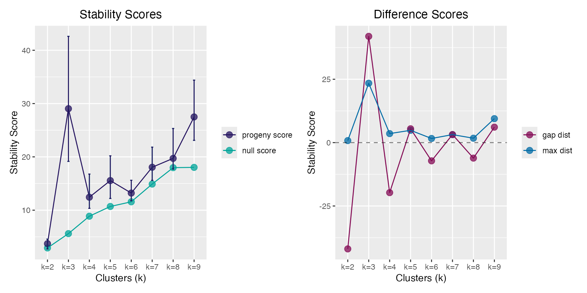

# Progeny and Stability Clustering

## Useful functions:

- [`progeny_cluster()`](https://stufield.github.io/stabilityselectr/reference/progeny_cluster.md):
  performs progeny clustering
- [`plot()`](https://rdrr.io/r/graphics/plot.default.html) and
  [`print()`](https://rdrr.io/r/base/print.html): S3 methods for class
  `pclust`
- [`stability_cluster()`](https://stufield.github.io/stabilityselectr/reference/stability_cluster.md):
  performs stability clustering

------------------------------------------------------------------------

## Progeny Clustering via `progeny_cluster()`

Select the optimal number for clustering using Progeny Clustering. The
“true” number of clusters in the `progeny_data` object is 3.

``` r

pc <- progeny_cluster(progeny_data, clust_iter = 2:9L,
                      repeats = 10L, n_iter = 25L, size = 6)
pc
#> ══ Progeny Clustering ═════════════════════════════════════════════════
#> • Call              'progeny_cluster(data = progeny_data, clust_iter = 2:9L, repeats = 10L, n_iter = 25L, size = 6)'
#> • Progeny Size      6
#> • K iterations      '2 → 9'
#> • No. iterations    25
#> • No. repeats       10
#> ── Mean & CI95 Stability Scores ───────────────────────────────────────
#>        k=2 ★k=3★  k=4  k=5  k=6  k=7  k=8  k=9
#> 2.5%  2.74  19.2 10.3 12.2 11.8 15.6 17.7 23.1
#> mean  3.72  29.0 12.4 15.6 13.2 18.1 19.7 27.5
#> 97.5% 4.58  42.6 16.8 20.2 15.6 21.8 25.3 34.4
#> ── Maximum Distance Scores ────────────────────────────────────────────
#>    k=2  ★k=3★    k=4    k=5    k=6    k=7    k=8    k=9 
#>  0.801 23.435  3.563  4.856  1.638  3.155  1.743  9.463
#> ── Gap Distance Scores ────────────────────────────────────────────────
#>    k=2  ★k=3★    k=4    k=5    k=6    k=7    k=8    k=9 
#> -41.93  41.93 -19.73   5.46  -7.19   3.18  -6.11   6.11
#> ═══════════════════════════════════════════════════════════════════════
```

``` r

plot(pc)
```



------------------------------------------------------------------------

## Stability Clustering via `stability_cluster()`

Partitioning Around Medoids (PAM) is used both because is uses a more
robust measurement of the cluster centers (medoids) and because this
implementation keeps the cluster labels consistent across runs, a key
feature in calculating the across run stability. This does not occur
using [`stats::kmeans()`](https://rdrr.io/r/stats/kmeans.html) where the
initial cluster labels are arbitrarily assigned.

True clusters are:

- cluster 1 -\> samples `1:50`
- cluster 2 -\> samples `51:100`
- cluster 3 -\> samples `101:150`

``` r

stab_clust <- stability_cluster(progeny_data, k = 3L, n_iter = 750L,
                                r_seed = 999) |>
  dplyr::mutate(true_cluster = rep(1:3L, each = 50L))

# 3-way confusion matrix
stab_clust |>
  with(table(truth = true_cluster, predicted = prob_k))
#>      predicted
#> truth  1  2  3
#>     1 49  1  0
#>     2  0 46  4
#>     3  1  1 48

# view incorrect clusters
stab_clust |>
  dplyr::filter(true_cluster != prob_k)
#> # A tibble: 7 × 5
#>   `k=1` `k=2` `k=3` prob_k true_cluster
#>   <dbl> <dbl> <dbl>  <int>        <int>
#> 1 0.388 0.427 0.185      2            1
#> 2 0.175 0.353 0.472      3            2
#> 3 0.171 0.393 0.436      3            2
#> 4 0.188 0.403 0.409      3            2
#> 5 0.169 0.359 0.472      3            2
#> 6 0.197 0.419 0.384      2            3
#> 7 0.66  0.179 0.161      1            3
```

### Plotting Clusters

We can plot the original `progeny_data` object, which has 3 true
clusters, and identify which samples that were “incorrectly” clustered
via stability clustering with an outline of the incorrect color.


------------------------------------------------------------------------

## References

Hu, CW, Kornblau, SM, Slater, JH and AA Qutub (2015). Progeny
Clustering: A Method to Identify Biological Phenotypes. Scientific
Reports, **5**:12894. <http://www.nature.com/articles/srep12894>
