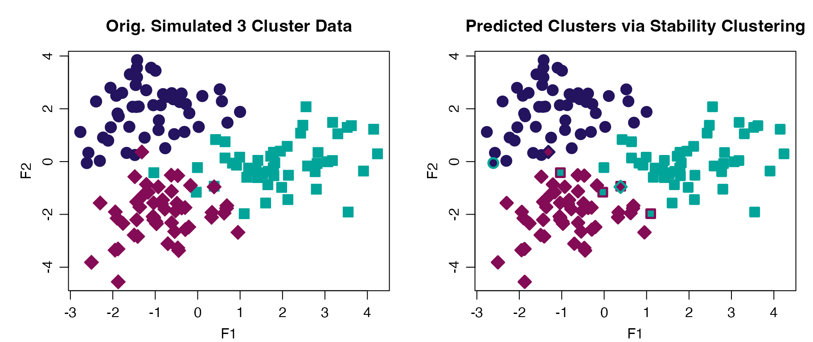

# Progeny and Stability Clustering

## Useful functions:

- [`progeny_cluster()`](https://stufield.github.io/stabilityselectr/dev/reference/progeny_cluster.md):
  performs progeny clustering
- [`plot()`](https://rdrr.io/r/graphics/plot.default.html) and
  [`print()`](https://rdrr.io/r/base/print.html): S3 methods for class
  `pclust`
- [`stability_cluster()`](https://stufield.github.io/stabilityselectr/dev/reference/stability_cluster.md):
  performs stability clustering

------------------------------------------------------------------------

## Progeny Clustering via `progeny_cluster()`

Select the optimal number for clustering using Progeny Clustering. The
“true” number of clusters in the `progeny_data` object is 3.

``` r

pc <- progeny_cluster(progeny_data, clust_iter = 2:9L,
                      reps = 10L, iter = 25L, size = 6)
pc
#> ══ Progeny Cluster Object ═════════════════════════════════════════════
#>    Call                     progeny_cluster(data = progeny_data, clust_iter = 2:9L, reps = 10L, iter = 25L, size = 6)
#>    Progeny Size             6
#>    No. of Iterations        25
#>    K Iterations             2 3 4 5 6 7 8 9
#> ── Mean & CI95 Stability Scores ───────────────────────────────────────
#>        k=2  k=3  k=4  k=5  k=6  k=7  k=8 k=9*
#> 2.5%  2.64 14.9 10.4 11.4 12.4 15.9 16.8 21.2
#>       3.65 19.6 12.7 15.0 13.6 17.6 20.3 25.9
#> 97.5% 4.31 33.0 16.8 22.2 15.2 19.6 24.5 28.5
#> ── Maximum Distance Scores ────────────────────────────────────────────
#>    k=2   k=3*    k=4    k=5    k=6    k=7    k=8    k=9 
#> -2.067 11.859  0.484  0.968 -3.475 -2.341 -1.119 -1.851
#> ── Gap Distance Scores ────────────────────────────────────────────────
#>    k=2   k=3*    k=4    k=5    k=6    k=7    k=8    k=9 
#> -22.87  22.87  -9.18   3.70  -5.38   1.25  -2.83   2.83
#> ═══════════════════════════════════════════════════════════════════════
```

``` r

plot(pc)
```


------------------------------------------------------------------------

## Stability Clustering via `stability_cluster()`

Partitioning Around Medoids (PAM) is used both because is uses a more
robust measurement of the cluster centers (medoids) and because this
implementation keeps the cluster labels consistent across runs, a key
feature in calculating the across run stability. This does not occur
using [`stats::kmeans()`](https://rdrr.io/r/stats/kmeans.html) where the
initial cluster labels are arbitrarily assigned.

Correct clusters are:

- cluster 1 -\> samples 1:50
- cluster 2 -\> samples 51:100
- cluster 3 -\> samples 101:150

``` r

stab_clust <- withr::with_seed(999,
  stability_cluster(progeny_data, k = 3L, iter = 500L)
)
stab_clust
#> # A tibble: 150 × 4
#>    `k=1` `k=2` `k=3` ProbK
#>    <dbl> <dbl> <dbl> <dbl>
#>  1 0.718 0.156 0.126     1
#>  2 0.684 0.172 0.144     1
#>  3 0.682 0.152 0.166     1
#>  4 0.664 0.19  0.146     1
#>  5 0.642 0.184 0.174     1
#>  6 0.7   0.154 0.146     1
#>  7 0.696 0.13  0.174     1
#>  8 0.644 0.154 0.202     1
#>  9 0.652 0.178 0.17      1
#> 10 0.682 0.154 0.164     1
#> # ℹ 140 more rows

# view 3-way confusion matrix
table(actual = rep(1:3, each = 50L), predicted = stab_clust$ProbK)
#>       predicted
#> actual  1  2  3
#>      1 49  1  0
#>      2  0 46  4
#>      3  1  0 49

# identify false clusters
stab_clust <- stab_clust |>
  dplyr::mutate(
    sample = dplyr::row_number(),
    pch    = rep(16:18, each = 50),
    pch    = dplyr::case_when(
      sample <= 50 & ProbK != 1L ~ 13L,                 # cluster 1
      sample > 50 & sample <= 100 & ProbK != 2L ~ 13L,  # cluster 2
      sample > 100 & ProbK != 3L ~ 13L,                 # cluster 3
      TRUE ~ pch
    )
  )

# view incorrect clusters (n = 6)
stab_clust |> dplyr::filter(pch == 13)
#> # A tibble: 6 × 6
#>   `k=1` `k=2` `k=3` ProbK sample   pch
#>   <dbl> <dbl> <dbl> <dbl>  <int> <int>
#> 1 0.37  0.442 0.188     2     43    13
#> 2 0.196 0.376 0.428     3     58    13
#> 3 0.228 0.346 0.426     3     73    13
#> 4 0.174 0.406 0.42      3     84    13
#> 5 0.162 0.388 0.45      3     86    13
#> 6 0.636 0.224 0.14      1    115    13
```

### Plotting Clusters

We can plot the `progeny_data` object, which has 3 main clusters, and
identify which samples that were “correctly” clustered via stability
clustering with an “X”.

``` r

par_def <- list(mgp = c(2, 0.75, 0), mar = c(3, 4, 3, 1))
par(par_def)
par(mfrow = 1:2L)
plot(progeny_data, col = rep(2:4, each = 50L),
     pch = rep(16:18, each = 50), cex = 1.75, main = "Simulated 3 Cluster Data")
plot(progeny_data, col = rep(2:4, each = 50), pch = stab_clust$pch, cex = 1.75,
     main = "Stability Clustering")
```



------------------------------------------------------------------------

## References

Hu, C.W., Kornblau, S.M., Slater, J.H. and A.A. Qutub (2015). Progeny
Clustering: A Method to Identify Biological Phenotypes. Scientific
Reports, 5:12894. <http://www.nature.com/articles/srep12894>
