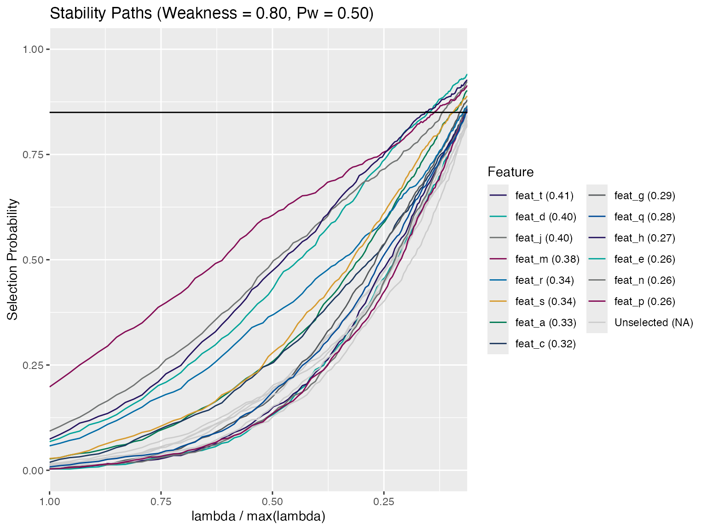

# Introduction to Stability Selection

The `stabilityselectr` package performs stability selection with a
variety of kernels provided by the `glmnet` package, and provides simple
tools for plotting and extracting selected features. There is additional
functionality designed to facilitate various forms of permutation
clustering analyses.

------------------------------------------------------------------------

## Useful functions in `stabilityselectr`

- [`stability_selection()`](https://stufield.github.io/stabilityselectr/dev/reference/stability_selection.md)
- [`is_stab_sel()`](https://stufield.github.io/stabilityselectr/dev/reference/stability_selection.md)
- [`get_stable_features()`](https://stufield.github.io/stabilityselectr/dev/reference/get_stable_features.md)
- [`get_threshold_features()`](https://stufield.github.io/stabilityselectr/dev/reference/get_stable_features.md)
- [`calc_emp_fdr()`](https://stufield.github.io/stabilityselectr/dev/reference/calc_emp_fdr.md)
- [`calc_emp_fdr_breaks()`](https://stufield.github.io/stabilityselectr/dev/reference/calc_emp_fdr_breaks.md)
- [`plot_emp_fdr()`](https://stufield.github.io/stabilityselectr/dev/reference/plot_emp_fdr.md)
- [`plot_permuted_data()`](https://stufield.github.io/stabilityselectr/dev/reference/plot_emp_fdr.md)
- [`progeny_cluster()`](https://stufield.github.io/stabilityselectr/dev/reference/progeny_cluster.md)
- [`stability_cluster()`](https://stufield.github.io/stabilityselectr/dev/reference/stability_cluster.md)

------------------------------------------------------------------------

## Examples

A typical stability selection analysis might be similar to the one
below.

#### Run `stability_selection()`

``` r

set.seed(101)
n_feat      <- 20L
n_samples   <- 100L
x           <- matrix(rnorm(n_feat * n_samples), n_samples, n_feat)
colnames(x) <- paste0("feat", "_", head(letters, n_feat))
y           <- sample(1:2, n_samples, replace = TRUE)
stab_sel    <- stability_selection(x, y, kernel = "l1-logistic", num_iter = 500L)
#> ✓ Using kernel: 'l1-logistic' and 1 core (serial)
is_stab_sel(stab_sel)
#> [1] TRUE
stab_sel
#> ══ Stability Selection (Kernel: l1-logistic) ══════════════════════════
#> • Weakness (alpha)            0.8
#> • Weakness Probability (Pw)   0.5
#> • Number of Iterations        500
#> • Standardized                'Yes'
#> • Imputed Outliers            'No'
#> • Lambda Max                  0.1879
#> • Lambda Min Ratio            0.1
#> • Permuted Data               'No'
#> • Random Seed                 506
#> ═══════════════════════════════════════════════════════════════════════
```

#### Plot stability paths

``` r

plot(stab_sel, thresh = 0.85)
```



#### Stable Features at a threshold

``` r

get_stable_features(stab_sel, thresh = 0.85)
#>        MaxSelectProb    FDRbound
#> feat_t         0.927 0.003571429
#> feat_d         0.917 0.007142857
#> feat_j         0.900 0.010714286
#> feat_m         0.898 0.014285714
#> feat_s         0.887 0.017857143
#> feat_g         0.863 0.021428571
#> feat_a         0.859 0.025000000
```

#### Stable Features at multiple thresholds

``` r

get_threshold_features(stab_sel, thresh_vec = seq(0.7, 0.9, 0.05))
#> $thresh_0.7
#>        MaxSelectProb FDRbound
#> feat_t         0.927  0.00625
#> feat_d         0.917  0.01250
#> feat_j         0.900  0.01875
#> feat_m         0.898  0.02500
#> feat_s         0.887  0.03125
#> feat_g         0.863  0.03750
#> feat_a         0.859  0.04375
#> feat_r         0.844  0.05000
#> feat_q         0.839  0.05625
#> feat_c         0.832  0.06250
#> feat_n         0.827  0.06875
#> feat_h         0.824  0.07500
#> feat_f         0.810  0.08125
#> feat_e         0.809  0.08750
#> feat_l         0.800  0.09375
#> feat_i         0.789  0.10000
#> feat_b         0.784  0.10625
#> feat_o         0.784  0.11250
#> feat_k         0.783  0.11875
#> feat_p         0.771  0.12500
#> 
#> $thresh_0.75
#>        MaxSelectProb FDRbound
#> feat_t         0.927    0.005
#> feat_d         0.917    0.010
#> feat_j         0.900    0.015
#> feat_m         0.898    0.020
#> feat_s         0.887    0.025
#> feat_g         0.863    0.030
#> feat_a         0.859    0.035
#> feat_r         0.844    0.040
#> feat_q         0.839    0.045
#> feat_c         0.832    0.050
#> feat_n         0.827    0.055
#> feat_h         0.824    0.060
#> feat_f         0.810    0.065
#> feat_e         0.809    0.070
#> feat_l         0.800    0.075
#> feat_i         0.789    0.080
#> feat_b         0.784    0.085
#> feat_o         0.784    0.090
#> feat_k         0.783    0.095
#> feat_p         0.771    0.100
#> 
#> $thresh_0.8
#>        MaxSelectProb    FDRbound
#> feat_t         0.927 0.004166667
#> feat_d         0.917 0.008333333
#> feat_j         0.900 0.012500000
#> feat_m         0.898 0.016666667
#> feat_s         0.887 0.020833333
#> feat_g         0.863 0.025000000
#> feat_a         0.859 0.029166667
#> feat_r         0.844 0.033333333
#> feat_q         0.839 0.037500000
#> feat_c         0.832 0.041666667
#> feat_n         0.827 0.045833333
#> feat_h         0.824 0.050000000
#> feat_f         0.810 0.054166667
#> feat_e         0.809 0.058333333
#> feat_l         0.800 0.062500000
#> 
#> $thresh_0.85
#>        MaxSelectProb    FDRbound
#> feat_t         0.927 0.003571429
#> feat_d         0.917 0.007142857
#> feat_j         0.900 0.010714286
#> feat_m         0.898 0.014285714
#> feat_s         0.887 0.017857143
#> feat_g         0.863 0.021428571
#> feat_a         0.859 0.025000000
#> 
#> $thresh_0.9
#>        MaxSelectProb FDRbound
#> feat_t         0.927 0.003125
#> feat_d         0.917 0.006250
#> feat_j         0.900 0.009375
```

------------------------------------------------------------------------

## Progeny and Stability Clustering

See separate vignette on clustering:
[`vignette("progeny-clustering")`](https://stufield.github.io/stabilityselectr/dev/articles/progeny-clustering.md).
